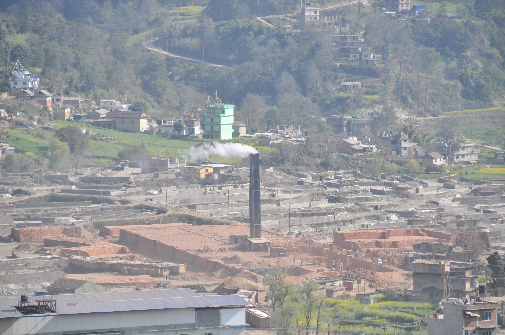
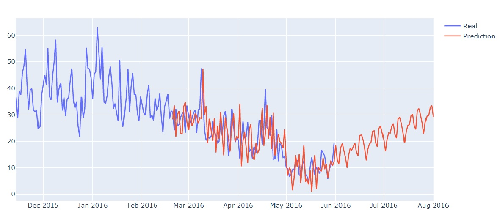

Data science is the study of extracting information from huge data to support decision-making. It is one of the most powerful tools for discovering and evaluating complex problems, generating solutions, and tracking progress. Today, data science has overtaken practically every industry in the world. It has become a power source for businesses, having a profound impact on banking, finance, manufacturing, e-commerce, education, and health industries. However, to this date, the applications of data science have been very less when it comes to understanding the natural environment and climate change.

The studies of the natural environment such as geosphere, hydrosphere, biosphere, climate, and atmosphere are increasingly data rich. These data can be utilized to support research and come up with the solution for major environmental projects ranging from climate monitoring to wildlife protection to waste management. With this article, I aim to highlight my experience of using Data Science in an environmental project and some of the applications of Data Science.

**A Data-Driven Environmental World** 

Data is linked with everything we do. Data is utilized to capture our actions, from posting on social media to buying groceries at the shop to calories that we consume. Likewise, data is also tied to every aspect of the environment, such as yearly precipitation and temperature, changes in the volume of glaciers, number of protected species, etc. Both data science and environmental science are interdisciplinary fields. Look at the air pollution photo below. This is an area where results can be made based on a variety of levels, based on many interconnected variables such as health and pollution, crop production and pollution, etc. Environmental science fields such as climatic variables, pollution, etc. are becoming more data-driven, and they are moving toward open-sourcing their data.

One of the most challenging and intriguing projects that I have even done in this coding world was on Time Series Analysis of Nitrogen Dioxide (NO2). Time series modeling is a powerful method to describe and extract information from time-based data and helps to make informed decisions about future outcomes. Thanks to this project, now I can retrieve CSV dataset, visualize and transform the dataset into times series, test whether the time series is stationary or not, transform time series to stationary, build seasonal Autoregressive Integrated Moving Average (SARIMA) model using grid search method, and finally predict NO2 (shown below). More details of this can be found on my GitHub. 

I was fascinated when I first came across an interesting technique that could be used to explore enormous datasets in novel ways to get forecasted results. After receiving quite interesting results with the ARIMA model, my curiosity for Data Science increased more.
Data science, in my opinion, is the future of data and the environment. That is the only way to assure that you get outstanding outcomes in a timely, repeatable, and consistent manner. 

**How Data Fellowship 2022 organized by Code for Nepal will further help me in my environmental career?**

Currently, I am enrolled in career building Data Analyst with Python course to gain experience in coding skills. The course focuses on applied learning, which means I am addressing problems using real-world datasets, which is the best part of this course. The data science skills that I have learned at the Data Fellowship so far came in handy when it came to manipulating and visualizing the data. While the lectures were an important part of their course, the actual learning happened while working on projects and doing hands-on exercises. These exercises were practical, entertaining, and enlightening, and they provided an excellent opportunity for me to put what I had learned in the lectures into practice.

Furthermore, after the completion of this course, Data Analyst with Python, I am sure that I will be able to analyze data-driven modeling approach, data- and knowledge-based approaches for disaster risk management, and approaches for uncertainty reduction with climatic vulnerability such as floods, droughts, etc. The approaches for uncertainty reduction can be done by combining diverse sources of data to create augmented claims, which then help in the creation of a vulnerability model.

**Application of Data Science in the environment world** 

Data Science can have an impact on the earth and environmental sciences, providing a rich tapestry of new techniques to support both a deeper understanding of the natural environment in all its complexities and the development of well-founded climate change mitigation and adaptation strategies. Some of the applications of data science that can be used in the environment field:
1.     **Forecasting and prediction**: The world’s most pressing environmental issues till today are climate change, floods, droughts, renewables energy, etc. All these issues are directly or indirectly heavily weather dependent such as temperature, precipitation, and wind. As a result, forecasting has become more critical in managing supply and demand, which must be balanced in real-time. From numerical weather predictions and historical data, data science allows us to develop reliable precipitation forecasts (which can be used to minimize the impacts of floods and droughts), wind forecasts (which can be used for more precise wind power production), temperature forecasts (which can be used to minimize the impacts of forest fire).
2.     **Better policy-making/ decisions**: There are many success stories of how rivers have improved their water quality after suffering waste pollution mainly from industrial areas. Looking at this data, we can identify and measure the effectiveness of regulatory interventions and inform future policy decisions. Using data science, we can better understand how our environment is changing, what might be driving those changes, how to manage the state of our environment better, and even how to consider what might happen in the future.
3.     **Disaster risk reduction planning**: Risks, vulnerabilities, and resilience may all be measured and understood with the use of data science. It is critical for disaster response, recovery, and planning. Improved resilience is achieved through risk assessment and risk reduction and data science can assist us in comprehending how disaster risk may evolve in the future. 
Data science can be applied in all fields of environmental science including but not limited to the climate, energy, geosphere, hydrosphere, biosphere, and atmosphere. With this data fellowship, I realized that environmental scientists, hydrologists, climate researchers should be encouraged and supported to create a culture shift toward open science, i.e., a science which is more collaborative and integrative through open approaches to data, models, and knowledge development, as well as more transparent, repeatable, and reproducible science.

**How to get involved with data and data science?**

Data Science is a new field with new technologies and the use of new approaches. We can draw insight from data and help build actionable and innovative solutions. However, the greatest approach to understanding a thing is to plunge in and practice it rather than studying its definition. Some of the ways are:
- Learn about statistics as statistical knowledge is important
- Get comfortable with R or Python as both the languages can be/ are extensively used in environmental projects.
- Learn about data analysis, manipulation, and visualization with pandas as these will significantly increase your efficiency when working with data.
- Try your data science environmental project. For example, try extracting and analyzing data from the internet such as data related to air pollution or the maximum temperature of Nepal for the last 20 years. Use these data for analysis, visualization and try making the best out of them.
